---
# https://vitepress.dev/reference/default-theme-home-page
layout: home

hero:
  name: "Python Mastery"
  text: "From Zero to Excel Automation"
  tagline: Complete beginner-friendly Python Mastery with hands-on projects and real-world applications
  actions:
    - theme: brand
      text: Start Learning →
      link: /session1
    - theme: alt
      text: Quick Reference
      link: /quick-reference

features:
  - title: 🐍 Beginner Friendly
    details: Start from absolute zero. No prior programming experience needed. We'll guide you through every step with clear explanations and practical examples.
  - title: 📊 Excel Automation Focus
    details: Learn Python with a purpose - automate Excel tasks, process data files, and build professional reports that save hours of manual work.
  - title: 🚀 Project-Based Learning
    details: Build real-world applications from day one. Each session includes hands-on exercises that prepare you for actual workplace scenarios.
---

# Complete Python Mastery Program

Welcome to your comprehensive Python learning journey! This training transforms complete beginners into confident Python developers with a focus on practical automation and data processing.

## 🎯 What Makes This Training Special

This isn't just another Python course. It's specifically designed for **professionals who want to automate their work** and solve real business problems with Python, particularly Excel automation and data processing tasks.

:::info Why This Training Works
✅ **Progressive Structure** - Each session builds on the previous one  
✅ **Practical Focus** - Every concept ties to real-world applications  
✅ **Hands-On Learning** - You'll be coding from lesson one  
✅ **Business Relevant** - Learn skills that immediately impact your work  
:::

## 📚 Complete Training Sessions

### 🌱 Foundation Level

Session 1: Python Fundamentals

Master the essential building blocks of Python programming

<ul>
<li>Understanding variables and data types</li>
<li>Getting user input and displaying output</li>
<li>Performing calculations and basic operations</li>
<li>Writing your first interactive programs</li>
</ul>
<a href="/session1">Begin Your Journey →</a>

Session 2: Smart Decision Making

Make your programs intelligent with conditional logic

<ul>
<li>Creating programs that make decisions</li>
<li>Using if/else statements effectively</li>
<li>Comparing values and handling multiple conditions</li>
<li>Building interactive questionnaires and validators</li>
</ul>
<a href="/session2">Level Up Your Skills →</a>

### 🔄 Automation Level

Session 3: Loops & Automation

Eliminate repetitive tasks with powerful loop structures

<ul>
<li>Automating repetitive operations with for and while loops</li>
<li>Processing multiple data items efficiently</li>
<li>Creating data collection and analysis scripts</li>
<li>Building your first automation tools</li>
</ul>
<a href="/session3">Automate Everything →</a>

Session 4: Data Management with Lists

Handle complex data collections like a professional

<ul>
<li>Creating and manipulating data collections</li>
<li>Sorting, filtering, and searching data</li>
<li>Building dynamic data processing systems</li>
<li>Preparing for real-world data scenarios</li>
</ul>
<a href="/session4">Master Data Handling →</a>

### 💼 Professional Level

Session 5: File & Excel Automation

Connect Python to your daily work with file processing

<ul>
<li>Reading and writing various file formats</li>
<li>Automating Excel spreadsheet operations</li>
<li>Processing CSV data and generating reports</li>
<li>Building robust error handling systems</li>
</ul>
<a href="/session5">Automate Your Workflow →</a>

Session 6: Capstone Project

Build a complete Excel automation system from scratch

<ul>
<li>Design and implement a multi-file processing system</li>
<li>Create professional reports with charts and summaries</li>
<li>Build user-friendly interfaces and error handling</li>
<li>Package your solution for distribution to others</li>
</ul>
<a href="/session6">Build Your Masterpiece →</a>

## 🎯 Your Learning Journey

This training follows a carefully crafted progression that takes you from complete beginner to automation expert:

```mermaid
graph LR
    A["🌱 Complete Beginner"] --> B["🐍 Python Basics"]
    B --> C["🤔 Decision Making"]
    C --> D["🔄 Automation"]
    D --> E["📊 Data Processing"]
    E --> F["📁 File Operations"]
    F --> G["🏆 Excel Automation Expert"]
```

## 🚀 Get Started Today

Ready to transform your work with Python automation?

1. **Complete Beginner?** → [Start with Session 1](/session1)
2. **Need a Quick Overview?** → [Check the Quick Reference](/quick-reference)
3. **Want to See the End Goal?** → [View the Final Project](/session6)

:::tip Success Guarantee
Follow this training step-by-step, complete the exercises, and you'll be automating Excel tasks and processing data files within weeks, not months.
:::

## 🎓 What You'll Achieve

By completing this training, you'll be able to:

- **Automate Excel Tasks** - Process spreadsheets, generate reports, and eliminate manual data entry
- **Build Professional Tools** - Create scripts that colleagues can use to streamline their work
- **Process Any Data File** - Handle CSV, Excel, and text files with confidence
- **Think Like a Programmer** - Break down complex problems into manageable, automated solutions
- **Save Hours Weekly** - Turn repetitive 2-hour tasks into 2-minute automated processes

## 💡 Learning Philosophy

Our approach emphasizes:
- **Learning by Doing** - Every concept comes with immediate practical application
- **Real-World Relevance** - All examples solve actual business problems
- **Progressive Complexity** - Each session builds naturally on the previous one
- **Confidence Building** - You'll feel accomplished after each session

---

*Ready to join thousands of professionals who've transformed their work with Python? Your automation journey starts now!*

